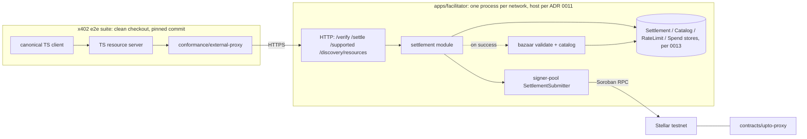
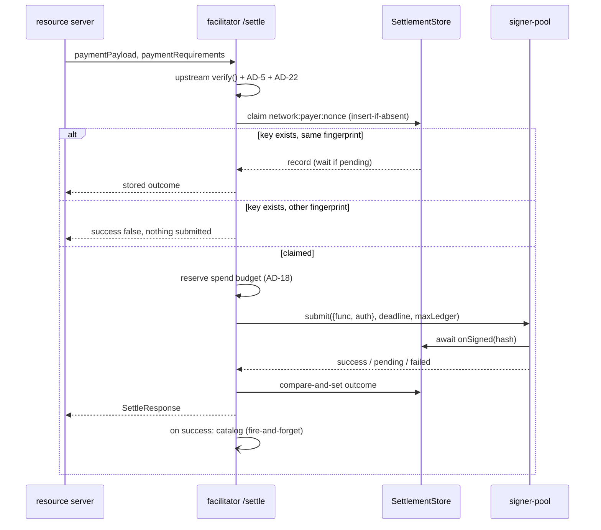

# Architecture Spine: stellar-x402 Milestone 1 (Tranche 1)

## Design Paradigm

**Modular monolith with ports and adapters.**

- **One service.** `apps/facilitator` is the only deployable service and the only composition root. It alone owns HTTP, environment and secrets, store adapters, rate limiting and wiring.
- **Libraries.** `packages/*` take their dependencies through constructors and hold no I/O policy of their own.
- **Contracts.** `contracts/` is a separate Cargo workspace, reached only through Soroban RPC.

| Layer               | Lives in                                                     | Owns                                                                                                   |
| ------------------- | ------------------------------------------------------------ | ------------------------------------------------------------------------------------------------------ |
| Adapters (inbound)  | `apps/facilitator/src/http/`                                 | x402 v2 routes, request validation, rate limiting, harness endpoints                                   |
| Application         | `apps/facilitator/src/`                                      | verify/settle orchestration, the settlement record lifecycle, spend budgets, cataloging trigger, ports |
| Adapters (outbound) | `apps/facilitator/src/adapters/`                             | store implementations (0013), signer, RPC, metrics                                                     |
| Domain libraries    | `packages/signer-pool`, `packages/bazaar`, `packages/config` | settlement submission, catalog validation and normalization, network constants                         |
| On-chain            | `contracts/upto-proxy`                                       | `upto` settlement contract                                                                             |

## Invariants & Rules

```mermaid
graph TD
  facilitator[apps/facilitator] --> signerpool[packages/signer-pool]
  facilitator --> bazaar[packages/bazaar]
  facilitator --> config[packages/config]
  facilitator --> x402[@x402/stellar + @x402/core + @x402/extensions]
  signerpool --> sdk[@stellar/stellar-sdk 16.x]
  bazaar --> config
  bazaar --> x402
  conformance[conformance] --> config
  x402 --> sdk
```

### AD-1: Dependency direction [ADOPTED]

- **Binds:** all workspace packages
- **Prevents:** libraries that read env or storage on their own, and import cycles.
- **Rule:**
  - Dependencies only point in the direction of the graph above.
  - `packages/*` never import from `apps/*`, never read `process.env`, and never open a store or socket that wasn't passed to them.
  - `packages/config` is the leaf.

### AD-2: One payment = one transaction through the channel pool [ADOPTED]

- **Binds:** T1-facilitator, T1-channel-pool, T1-upto-prototype (ADR 0003)
- **Prevents:** a second submit path that bypasses the pool's sequence handling, fee policy and confirmation.
- **Rule:**
  - Every settlement is submitted with `SettlementSubmitter.submit()` from `packages/signer-pool`, in the delegated-bump shape: the channel is the transaction source, the facilitator is the operation source and pays the fee bump.
  - Nothing else in the service calls `sendTransaction`.
  - The `upto` testnet harness (0004) uses the same shape.

### AD-3: Upstream verifies, we settle

- **Binds:** `/verify`, `/settle` for `exact`
- **Prevents:** verification rules drifting from the spec, and upstream's own submit path being used next to the pool.
- **Rule:**
  - **Upstream owns verification.** Auth signature and scope checks, `Address`/`AddressV2` credentials, simulation and the event checks all belong to `@x402/stellar` `ExactStellarScheme.verify()`. We never re-implement them.
  - **Construction.** `ExactStellarScheme` is constructed with the fee values from AD-10.
  - **`/verify`** = upstream `verify()`, then the AD-5 channel check, then the AD-22 validity check. Any failure returns `isValid: false` with its reason.
  - **`/settle`** runs the same three checks again. It then claims the record (AD-6), builds `{func, auth}` from the client's payload and submits it as in AD-2. The pool's `checkSimulation` hook enforces the spec's balance-change check.
  - Upstream's `ExactStellarScheme.settle()` is never called.

### AD-4: Channel accounts count as the facilitator

- **Binds:** T1-facilitator, T1-channel-pool, T1-upto-prototype
- **Prevents:** a different transaction shape per scheme, or a fallback to facilitator-sourced transactions.
- **Rule:**
  - Channel accounts controlled by the facilitator key satisfy "facilitator as source" in `scheme_exact_stellar.md`.
  - This reading is recorded in [ADR 0005](../adr/0005-channel-accounts-as-facilitator-source.md).
  - Proposing it upstream is deferred.

### AD-5: Payloads must not touch our channel accounts

- **Binds:** `/verify`, `/settle`
- **Prevents:** a crafted payload spending or authorizing through a channel account. Upstream `verify()` only knows our signer addresses, not the channels.
- **Rule:**
  - A payload is rejected when a channel address appears as the transaction source, an operation source, `from`, or the address of any auth entry. Both `Address` and `AddressV2` credentials are checked.
  - The check runs in `/verify` and again in `/settle`.

### AD-6: Claim, dedupe and replay of a settlement

- **Binds:** `/settle`, `SettlementStore`
- **Prevents:**
  - double submission
  - paying N−1 fees for N parallel calls
  - one payment being replayed to unlock another merchant's resource
- **Rule:**
  - **Key.** The settlement key is `network:payer:nonce`. The nonce is the int64 nonce of the payer's auth entry, held as a decimal string. A payload must carry exactly one payer auth entry, otherwise it is rejected.
  - **Fingerprint.** Each record stores a fingerprint: a hash of the canonical payload plus `paymentRequirements`.
  - **Claim.** After verification and before `submit()`, `/settle` claims the key with an atomic insert-if-absent. Only the caller that wins the claim submits.
  - **Repeat with the same fingerprint.** A repeat `/settle` returns the record's outcome. If the record is still pending, it waits, bounded by the settle timeout, for the final outcome before answering.
  - **Repeat with a different fingerprint.** Rejected with `success: false`. Nothing is submitted, and the stored outcome is never returned.
  - **Wire shape.** `SubmitStatus` maps as follows:
    - `success` → `{success: true, transaction, network, payer}`
    - `pending` → `{success: false, errorReason: "settlement_pending", transaction, network}`
    - `failed` / `rejected` / `expired` → `{success: false, errorReason}`
    - Each thrown submitter error class maps to a fixed `errorReason`, listed with the code.
  - **Deadline.** The submit `deadline` comes from the client's signature expiry.

### AD-7: State goes through ports the facilitator owns

- **Binds:** T1-facilitator, T1-bazaar-foundation
- **Prevents:** packages or handlers talking to a database directly, and rework when 0013 picks the store.
- **Rule:**
  - All state goes through four interfaces defined in `apps/facilitator`: `SettlementStore`, `CatalogStore`, `RateLimitStore` and `SpendStore`.
  - Concrete adapters live in `apps/facilitator/src/adapters/`, and there is an in-memory fake of each for tests.
  - The backing store is chosen by task 0013. It must support:
    - the atomic claim (AD-6)
    - lookup by any of a settlement's hashes (AD-16)
    - the channel lease (AD-17)
    - the catalog key and the `resources` filters (AD-19, AD-20)

### AD-8: Cataloging never blocks settle

- **Binds:** T1-bazaar-foundation, `/settle`
- **Prevents:** a Bazaar bug failing, delaying or changing a payment.
- **Rule:**
  - **Trigger.** Cataloging starts when a settlement's record turns `success`. That covers both an immediate success and a later `resolved` success.
  - **Ordering.** The store write runs after the response, fire-and-forget. Its errors are logged and counted, never returned to the caller.
  - **Response header.** Only the pure, synchronous AD-19 validation may run before responding. It sets a best-effort `EXTENSION-RESPONSES` header (`processing` or `rejected`). It never changes the response body or status.

### AD-9: Any SEP-41 token, no allowlist

- **Binds:** `/verify`, `/settle`, `/supported`
- **Prevents:** per-token code paths and an asset list in config.
- **Rule:**
  - Verification doesn't depend on the token: the asset comes from `paymentRequirements`, and the simulated balance changes are checked.
  - The test matrix covers testnet USDC, a self-issued SAC and a non-SAC SEP-41 token.
  - Abuse through junk tokens is contained by AD-18, not by an allowlist.

### AD-10: The facilitator pays fees from one fee configuration [ADOPTED]

- **Binds:** `/verify`, `/settle`, signer-pool and `ExactStellarScheme` configuration
- **Prevents:**
  - clients setting our fee
  - verify and settle using different fee ceilings
  - unbounded fee spend
- **Rule:**
  - **Fee.** It is the simulation resource fee plus our inclusion bid, which is at least 100 stroops. The client's fee is never used.
  - **One config value per setting:**
    - `maxFeeStroops` feeds both the upstream `maxTransactionFeeStroops` and the pool's `maxFeeStroops`.
    - `inclusionFeeStroops` feeds both components.
  - **Escalation.** `feeEscalation` is set by the app. T1 uses interim testnet values from config; the mainnet values come from task 0010.

### AD-11: Rate limiting

- **Binds:** inbound HTTP adapter
- **Prevents:** one caller exhausting the pool or our fee budget, and limits implemented differently per route.
- **Rule:**
  - One middleware, with separate budgets for `/verify`, `/settle` and `/discovery/*`. Exceeding a budget returns HTTP 429.
  - **Client IP.** It comes from the configured trusted-proxy hops only, never from a raw `X-Forwarded-For`.
  - **API key.** An optional per-caller API key is accepted as an alternative limiter key. It is not required in T1.
  - **Storage.** Counters go through `RateLimitStore`.
  - **Payer, recipient and asset.** Limits on these are AD-18's job, not the IP limiter's.

### AD-12: One facilitator key per network; channels are hardened

- **Binds:** configuration, `TransactionSigner`, startup
- **Prevents:** key sprawl, keys shared between networks, and channels another key can move.
- **Rule:**
  - **Key.** Each network has one facilitator key. It signs for the channels and pays fee bumps, and it reaches the pool only as a `TransactionSigner`, so a KMS can replace it.
  - **Config.** `FACILITATOR_SECRET` plus `CHANNELS` (addresses, never secrets).
  - **Startup check.** The service refuses to start unless every channel has its master key weight at 0 and the facilitator key as its only signer (`checkChannel`).
  - **Separation.** Testnet and mainnet never share a key or a channel.

### AD-13: Wire protocol is x402 v2 only [ADOPTED]

- **Binds:** all facilitator routes
- **Prevents:** half-supported v1 paths and response shapes drifting from `@x402/core`.
- **Rule:**
  - Request and response bodies are `@x402/core` v2 types.
  - **`/supported`** lists:
    - `kinds`: `exact` on `stellar:testnet` with `extra.areFeesSponsored: true`
    - `extensions`: `bazaar`
    - `signers`: the facilitator key's address only, never the channels
  - `upto` is not advertised until its `/settle` wiring exists (post-T1).

### AD-14: One upstream version

- **Binds:** all workspace `package.json` files
- **Prevents:** two copies of `@x402/core` or `@stellar/stellar-sdk` in one process.
- **Rule:**
  - All `@x402/*` packages share one pinned minor, `~2.28.0` from T1.
  - `@stellar/stellar-sdk` stays on `^16.3.0`. `@x402/stellar` 2.28 requires 16.x, and our code uses the XDR accessor API.
  - A protocol-29 XDR fixture test (`AddressV2`) guards this rule.

### AD-15: The gate runs from our repo against a clean upstream checkout

- **Binds:** T1-e2e-gate, `conformance/`, facilitator HTTP adapter
- **Prevents:**
  - a modified client or harness, which voids the gate
  - unreproducible runs
  - pushing to `x402-foundation/x402` during M1
- **Rule:**
  - **The proxy** lives in `conformance/external-proxy/`. It contains:
    - a `test.config.json` with `name`, `type: facilitator`, `language: typescript`, `protocolFamilies: [stellar]`, `schemes: [exact]`, `x402Versions: [2]`, and `environment.required` naming our facilitator-URL env var
    - a `run.sh` that listens on `PORT`, prints `Facilitator listening`, answers `GET /health` and `POST /close` itself, and forwards `/verify`, `/settle` and `/supported` to our URL
  - **The run.** A `conformance/` script clones `x402-foundation/x402` read-only at a pinned commit, copies in only that folder, and runs the Stellar `exact` scenarios with `--output-json`.
  - **The evidence.** Results, including the upstream commit and transaction hashes, are committed to `conformance/results/`.

### AD-16: One owner of the settlement record lifecycle

- **Binds:** `/settle`, the `resolved` event handler, startup
- **Prevents:**
  - a late `resolved` event overwritten by an earlier `pending` write
  - records stuck pending forever after a restart
- **Rule:**
  - **One owner.** A single settlement module in `apps/facilitator` owns every write to `SettlementStore`. Handlers and event listeners call it; they never write to the store themselves.
  - **States.** They only move forward: `claimed → signed → pending → success | failed | rejected | expired`. Each write is a compare-and-set, so a write that would move a record backwards is dropped.
  - **Hashes.** A record keeps every hash it was signed with, because a rebuild produces a new one. It can be found by any of them.
  - **Durable write.** The hash is stored durably before the first send. This requires `signer-pool` to await an async `onSigned` and to abort the send if it rejects; that change to the library is a T1 prerequisite.
  - **Startup.** Before accepting traffic, the module re-checks every non-final record on chain by its hashes and finalizes it.

### AD-17: One process owns a channel set

- **Binds:** deployment, startup, shutdown
- **Prevents:** two processes using one channel's sequence numbers, for example during a rolling deploy.
- **Rule:**
  - **Lease.** At startup a process takes an exclusive lease on its network's channel set through the store and keeps renewing it. Without the lease it doesn't serve `/settle`.
  - **Deploys.** They stop the old process before the new one takes the lease.
  - **Shutdown.** The process stops accepting `/settle`, waits until every in-flight submission is final or recorded as pending, then releases the lease.

### AD-18: Spend budgets contain fee abuse

- **Binds:** `/settle`, `SpendStore`, alerts
- **Prevents:** someone draining the facilitator's XLM through valid self-payments or junk tokens, which IP limits can't stop.
- **Rule:**
  - **Budgets.** Before `submit()`, `/settle` checks and reserves the fee against:
    - a global rolling fee budget
    - per-payer, per-`payTo` and per-asset budgets
  - **Over budget.** Returns `success: false` and submits nothing.
  - **Circuit breaker.** A breaker per asset and per `payTo` opens after repeated on-chain failures.
  - **Alerts.** These raise alerts:
    - the budget nearing its limit
    - an open breaker
    - a low facilitator balance (`checkFacilitatorBalance`)
    - quarantined channels
    - pending results

### AD-19: Catalog integrity

- **Binds:** T1-bazaar-foundation, `packages/bazaar`
- **Prevents:**
  - a parallel Bazaar schema
  - duplicate entries for one route
  - SSRF through seller URLs
  - listings without a payment behind them
- **Rule:**
  - **Trigger.** A resource is cataloged only when its settlement succeeded and the client's payload carries `extensions.bazaar`. Nothing else is indexed.
  - **Types and validator.**
    - Types come from `@x402/extensions` (bazaar). `packages/bazaar` holds only a pure validator and normalizer.
    - The validator accepts both `http` and `mcp` input types.
    - Required fields that are malformed reject the listing. Optional fields that are malformed (`serviceName`, `tags`, `iconUrl`) are dropped.
  - **`iconUrl`.** It must be absolute https, with no IP literals and no loopback or private hosts. The facilitator never fetches any seller-supplied URL in T1.
  - **Catalog key.** It is `network + payTo + method + normalized resource URL` (with `routeTemplate` applied).
  - **Upserts.** They are idempotent and update `lastUpdated`.

### AD-20: Discovery resources contract

- **Binds:** `GET /discovery/resources`, `CatalogStore`
- **Prevents:** a response shape that differs from the x402 discovery ecosystem.
- **Rule:**
  - The response uses the upstream discovery list types.
  - Filters: `type`, `payTo`, `network`, `extensions`, `limit`, `offset`.
  - `limit` is bounded, with a fixed default.
  - No ranking in T1.

### AD-21: Non-custodial [ADOPTED]

- **Binds:** all
- **Prevents:** the facilitator becoming a holder of client funds.
- **Rule:**
  - The facilitator never takes custody of client or seller funds and never extends credit (ADR-R6).
  - Its accounts hold only XLM for fees and channel reserves.

### AD-22: Minimum remaining validity

- **Binds:** `/verify`, `/settle`, signer-pool
- **Prevents:** paying the fee for a transaction whose authorization expires before it can land.
- **Rule:**
  - A payload whose auth expiration ledger is less than `minValidityLedgers` ahead of the current ledger is rejected.
  - The transaction's time bound never extends past the auth expiry. This needs a `maxLedger` submit option in `signer-pool`, a T1 prerequisite.

## Consistency Conventions

| Concern               | Convention                                                                                                                                                                                           |
| --------------------- | ---------------------------------------------------------------------------------------------------------------------------------------------------------------------------------------------------- |
| Files and modules     | kebab-case file names; ESM with `.js` suffixes on local imports                                                                                                                                      |
| Errors in libraries   | typed `Error` subclasses with `override readonly name`; never thrown strings                                                                                                                         |
| HTTP status           | verify and settle outcomes are x402 bodies (`isValid` / `success` with a reason) with status 200; 400 for malformed requests, 429 for rate limits, 500 for unexpected errors                         |
| Amounts               | `bigint` in code (token base units, fees in stroops); decimal strings on the wire and in the store                                                                                                   |
| Identifiers           | networks as CAIP-2 strings from `packages/config`; transaction hashes as 64-character lowercase hex; settlement key as in AD-6                                                                       |
| Config                | read and validated once at startup in `apps/facilitator` (zod); passed down through constructors. RPC URLs come from config, a fallback list is allowed, and public testnet RPC is acceptable for T1 |
| Time and I/O in tests | `rpc`, `now` and `sleep` injected; store ports faked in memory                                                                                                                                       |
| Logging and metrics   | structured, one event per line, carrying `network`, settlement key and the transaction hash where known; secrets and full XDR are never logged; pool `onEvent` forwarded to metrics                  |
| HTTP hardening        | request body size limit; no CORS on `/verify` and `/settle`; trusted proxy hops set from config                                                                                                      |
| Testing               | unit tests with fakes in each package; facilitator integration tests against in-memory stores and `fake-rpc`; testnet runs (AD-9 token matrix, AD-15 gate) record their transaction hashes           |

## Stack

| Name                                        | Version                                                            |
| ------------------------------------------- | ------------------------------------------------------------------ |
| Node.js                                     | >=22.12 (22 LTS, maintenance until 2027-04; CI also runs 24)       |
| pnpm                                        | 11.5.2                                                             |
| TypeScript                                  | ~6.0.3 (ESM, NodeNext, strict; staying on 6.x in T1 is deliberate) |
| @x402/core, @x402/stellar, @x402/extensions | ~2.28.0                                                            |
| @stellar/stellar-sdk                        | ^16.3.0                                                            |
| express                                     | ^5.2.1                                                             |
| zod                                         | ^3.25.76 (to be added to `apps/facilitator`)                       |
| vitest                                      | ^5.0.2                                                             |
| x402 protocol                               | v2                                                                 |
| soroban-sdk / Rust / stellar-cli            | 28.0.0 / 1.97.1 / 28.1.0                                           |
| Network                                     | Stellar testnet (`stellar:testnet`), protocol 29                   |

## Structural Seed





```text
apps/facilitator/src/
  http/         # routes, validation, rate limiting, body limits
  settlement/   # verify + settle orchestration, record lifecycle, spend budgets
  ports/        # SettlementStore, CatalogStore, RateLimitStore, SpendStore
  adapters/     # store, signer, metrics implementations
conformance/
  external-proxy/   # test.config.json, run.sh
  results/          # committed run outputs with tx hashes
```

## Capability → Architecture Map

| Capability / Area                            | Lives in                                    | Governed by                                      |
| -------------------------------------------- | ------------------------------------------- | ------------------------------------------------ |
| T1-facilitator: verify/settle/supported      | `apps/facilitator`                          | AD-3, AD-5, AD-6, AD-9, AD-13, AD-16, AD-22      |
| T1-facilitator: sponsored fees               | `apps/facilitator` + `signer-pool` config   | AD-10, AD-12, AD-18, AD-21                       |
| T1-facilitator: rate limiting                | `apps/facilitator/src/http`                 | AD-11, AD-18, AD-7                               |
| T1-channel-pool                              | `packages/signer-pool`                      | AD-2, AD-4, AD-12, AD-16, AD-17, AD-22, ADR 0003 |
| T1-bazaar-foundation: resources + cataloging | `packages/bazaar`, `apps/facilitator`       | AD-7, AD-8, AD-19, AD-20                         |
| T1-upto-prototype                            | `contracts/upto-proxy`, tasks 0004 and 0005 | AD-2, AD-4, AD-13 (not advertised)               |
| T1-e2e-gate                                  | `conformance/`                              | AD-15, AD-13, AD-6 (pending wait)                |

## Decision Records

The rationale and rejected alternatives for these ADs are in ADRs:

| ADR                                                           | Covers                             |
| ------------------------------------------------------------- | ---------------------------------- |
| [0003](../adr/0003-settlement-channel-account-pool.md)        | AD-2                               |
| [0004](../adr/0004-facilitator-shape.md)                      | AD-1, AD-3, AD-7, AD-8             |
| [0005](../adr/0005-channel-accounts-as-facilitator-source.md) | AD-4, AD-5, AD-12, AD-13 (signers) |
| [0006](../adr/0006-settlement-record.md)                      | AD-6, AD-16, AD-17, AD-22          |
| [0007](../adr/0007-fee-abuse-containment.md)                  | AD-9, AD-10, AD-11, AD-18, AD-21   |
| [0008](../adr/0008-bazaar-catalog-integrity.md)               | AD-8 (header), AD-19, AD-20        |
| [0009](../adr/0009-conformance-gate-harness.md)               | AD-13, AD-15                       |
| [0011](../adr/0011-facilitator-hosting.md)                    | AD-15, AD-17 (deploys)             |

## Deferred

- **State store:** task 0013 decides, with an ADR. Only the ports and their required operations (AD-7) are fixed here.
- **Hosting, container setup, key custody, logger, metrics and alert backend:** decided in [ADR 0011](../adr/0011-facilitator-hosting.md) (task 0014): ECS on Fargate in AWS, CloudWatch logs, EMF metrics and alarms to Slack. Constraints it meets:
  - the process is long-lived, and scale-to-zero is not allowed
  - the lease and stop-before-start deploys from AD-17 apply
- **Mainnet fee values** (`feeEscalation`, `maxFeeStroops`): task 0010. T1 uses interim testnet values.
- **Numeric budgets and limits** (AD-11, AD-18, AD-22): set in config during the T1 build and recorded with the facilitator task.
- **`upto` settlement in `/settle`:** after T1 (task 0015).
- **Bazaar search and ranking, MCP server, SDK helpers:** later tranches.
- **Mainnet and its RPC provider:** later tranche, as a separate deployment per AD-12.
- **Runtime pool resizing and operations:** task 0011.
- **Batch settlement (B2):** task 0008.
- **Proposing the AD-4 reading upstream:** after T1; nothing is pushed to `x402-foundation/x402` in M1.

## Open Questions

- **`upfront` payment flow:** what does `/exact/stellar/upfront` in the e2e catalog require from a Stellar facilitator? Not a blocker for building; confirm before the first gate run (owned by the gate task).
- **Backlog alignment (done 2026-10-07):**
  - 0009 is now T1 `exact` wiring
  - 0015 holds `upto` `/settle`, after T1
  - 0016 holds the signer-pool prerequisites (awaited `onSigned`, `maxLedger`, the XDR fixture)
  - 0004, 0005, 0011, 0013 and 0014 are updated
  - the stories for the rest of T1 are in `docs/planning/m1-epics.md` (tasks 0017–0032)
