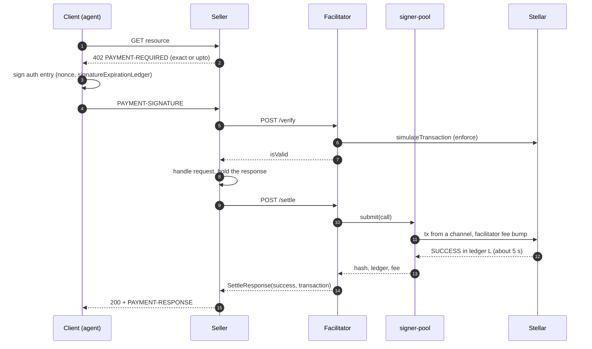
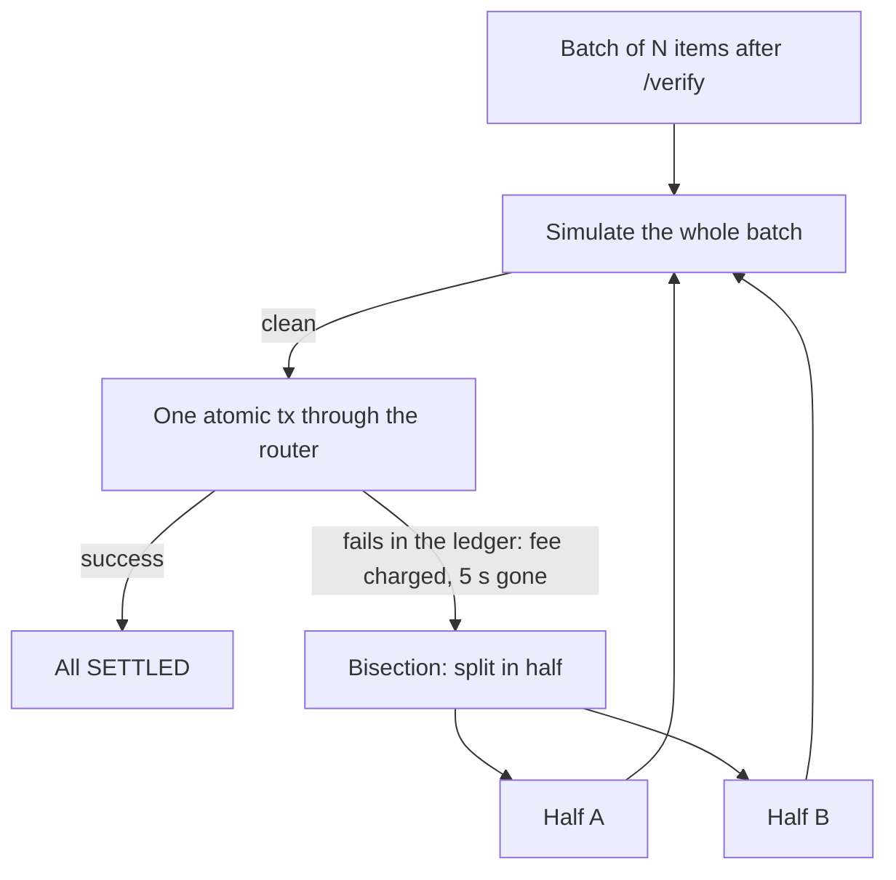
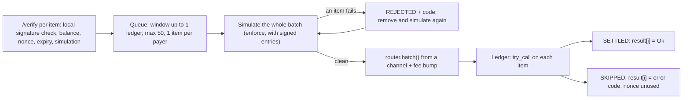
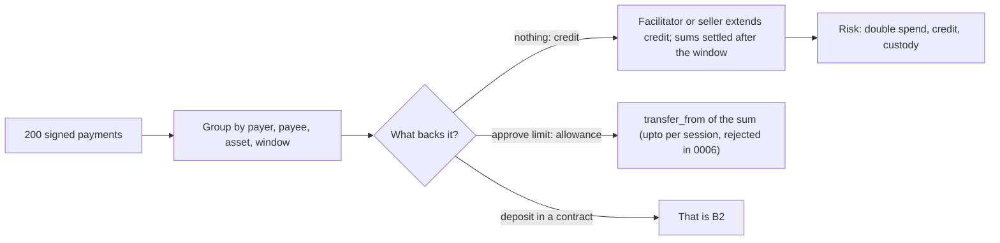
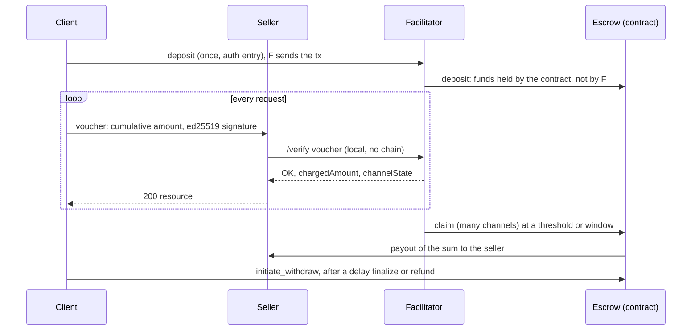
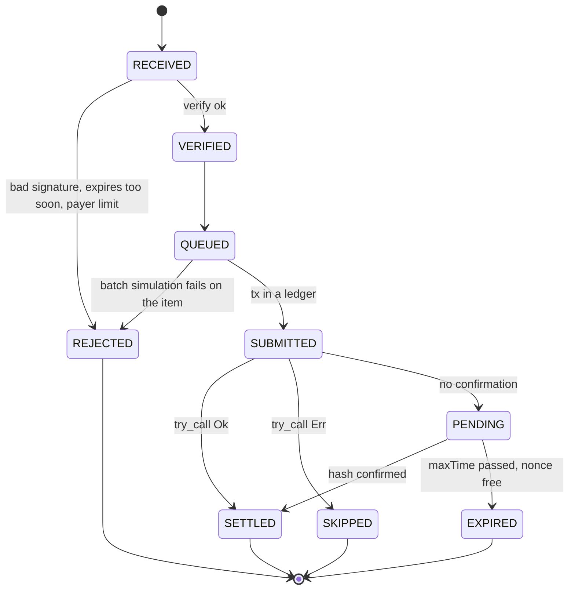
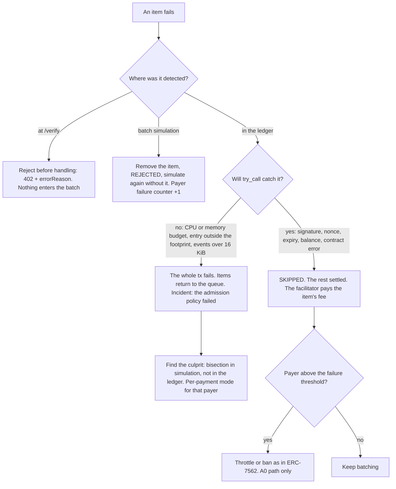

_stellar-x402 · research and architecture analysis · 2026-10-06_

# Scaling x402 settlement on Stellar

How many x402 payments a facilitator can settle per second, and how to get past that ceiling: packages where each item gets its own status (direction A), or aggregation and payment channels (direction B). The limits were checked live on mainnet and testnet, and the prior art is linked. Nothing was written to the repository.

## TL;DR

1. **"100 / 40" are not the facilitator's limits.** The 100 operations per transaction limit applies only to classic Stellar operations. A Soroban transaction always has _exactly one_ operation, so in x402 one payment is one transaction. The ~100 is a coincidentally similar byte ceiling of the _whole network_ for the `upto` shape (≈105 settlements per ledger, ≈21/s). The ~40 is the free capacity the repo measured on 5 October (43 per ledger, ≈8.6/s). Both are _per ledger (5 s)_, not "at once" or "per second".
2. **The real constraints.** The network takes 266,240 B of Soroban transactions per ledger, and a ledger closes every 5 s. That gives a ceiling of ≈219 `exact` or ≈105 `upto` payments per ledger _for the whole network_. Today, bidding a 200-stroop fee, the average free space is ≈42 `exact` or ≈20 `upto` per ledger (≈8 and ≈4 per second). About 98% of the used space is KALE bots paying minimal fees, so free capacity depends on the fee bid. It is not a constant.
3. **Direction A (batching) gives at most ≈1.6×.** A try/skip router isolates bad items: bad signatures, replays, expiry and insufficient funds are caught and rolled back, and the nonce stays unused. Budget overruns, entries outside the footprint and events over 16 KiB cannot be caught. Batching `exact` also breaks the current Stellar spec, which allows a single `transfer` per transaction.
4. **Direction B only makes sense as a deposit-backed channel.** That means a Stellar binding of the x402 `batch-settlement` scheme, which already runs on EVM (CDP) and Solana (PayAI). "Cashier-style" netting on credit turns the facilitator into an entity holding funds (MiCA, PSD2, FinCEN). True multilateral netting gains almost nothing in x402, because payments flow one way: from buyer to seller.

**Recommendation.** For now, stay with A0: one payment = one transaction through the channel pool from PR #4, plus a dynamic inclusion-fee bid and `settlement_pending`. The path to scale is B2, a Stellar binding for `batch-settlement`: one immutable escrow contract for many channels, with ed25519 vouchers, agreed with the x402 TSC. Treat A2 (try/skip router) only as a spike and an upstream proposal. Reject A1 (atomic batch with bisection) and netting on credit.

- **1 op / tx**: Soroban allows one InvokeHostFunction per transaction
- **266,240 B**: Soroban transaction-size limit per ledger (mainnet)
- **5,000 ms**: target ledger time; 360 of 360 samples = 5 s
- **81%**: average Soroban byte usage on mainnet today
- **≈219 / ≈105**: network ceiling for exact / upto per ledger
- **≈1.6×**: maximum gain from batching (router)

## Verifying the limits: what we assumed and what is true

I read the network configuration straight from RPC (`getLedgerEntries` on the `CONFIG_SETTING` keys, [method](https://developers.stellar.org/docs/data/apis/rpc/api-reference/methods/getLedgerEntries)). I read it on 2026-10-06 on mainnet (ledger 64,799,372) and on testnet. Both networks run protocol 29. The versions page lists protocol 28 as the latest ([source](https://developers.stellar.org/docs/networks/software-versions)), but RPC returns 29. The docs no longer print current values. They point to [Stellar Lab](https://lab.stellar.org/network-limits) and `stellar network settings` ([source](https://developers.stellar.org/docs/networks/resource-limits-fees)).

`[FACT]` claim with a source · `[MEASURED]` my measurement on 2026-10-06 (scripts in the session scratchpad, outside the repo) · `[HYPOTHESIS]` needs confirmation

### What we assumed and what remains of it

| Assumption                 | What it actually refers to                                                                                                                                                                                                                                                                                                                                                                                                                                                                                                                                                                                                                                                                                                    | Verdict                                                               |
| -------------------------- | ----------------------------------------------------------------------------------------------------------------------------------------------------------------------------------------------------------------------------------------------------------------------------------------------------------------------------------------------------------------------------------------------------------------------------------------------------------------------------------------------------------------------------------------------------------------------------------------------------------------------------------------------------------------------------------------------------------------------------- | --------------------------------------------------------------------- |
| "100 operations in one tx" | Classic operations (e.g. Payment) can go 1–100 per transaction. A transaction with `InvokeHostFunction`, `ExtendFootprintTTL` or `RestoreFootprint` has _exactly one_ operation `[FACT]` ([operations-and-transactions](https://developers.stellar.org/docs/learn/fundamentals/transactions/operations-and-transactions), [stellar-transaction](https://developers.stellar.org/docs/learn/fundamentals/contract-development/contract-interactions/stellar-transaction)). The x402 client signs a Soroban auth entry, not a transaction, so classic multi-op doesn't help: the client would have to sign the whole transaction together with other payers, and the limit is 20 signatures (confirmed in the PR #4 smoke test). | ❌ does not apply to x402                                             |
| "~100 at once, in theory"  | The byte ceiling of the _whole network_ for the `upto` shape: 266,240 / 2,516 B ≈ 105 per ledger, ≈21/s `[MEASURED]`. For `exact` (≈1,212 B) it is ≈219 per ledger, ≈44/s `[HYPOTHESIS: size built offline]`. If "at once" means "in flight", the number of channels decides: one source account means one transaction per ledger ([source](https://stellar.org/blog/developers/proposed-changes-to-transaction-submission), confirmed by 0006 burst-20).                                                                                                                                                                                                                                                                     | ⚠️ order of magnitude right, but per ledger and for the whole network |
| "~40 in practice"          | The free capacity the repo measured on 2026-10-05: 43 `upto` settlements per ledger ([R-network-limits](https://github.com/rumblefishdev/stellar-x402/blob/develop/lore/1-tasks/archive/0006_RESEARCH_upto-settlement-scaling/notes/R-network-limits-and-mainnet-usage.md)). Today the average is ≈20 `upto` or ≈42 `exact` per ledger, and the median ≈13 and ≈27 `[MEASURED]`. The value depends on price: 98% of the competition is KALE bidding 100–200 stroops.                                                                                                                                                                                                                                                          | ⚠️ variable; depends on the fee bid                                   |

### Soroban limits (mainnet = testnet, protocol 29)

| Resource                                | Per transaction | Per ledger                  | Source                                                                                                                                                                       |
| --------------------------------------- | --------------- | --------------------------- | ---------------------------------------------------------------------------------------------------------------------------------------------------------------------------- |
| Operations (Soroban)                    | 1               | —                           | [docs](https://developers.stellar.org/docs/learn/fundamentals/transactions/operations-and-transactions)                                                                      |
| Classic operations                      | 100             | 1,000                       | [docs](https://developers.stellar.org/docs/learn/fundamentals/fees-resource-limits-metering); ledger header `max_tx_set_size` `[MEASURED]`                                   |
| Number of Soroban transactions          | —               | 2,000                       | `ledger_max_tx_count` `[MEASURED]`                                                                                                                                           |
| **Transaction size**                    | 132,096 B       | **266,240 B**               | `contract_bandwidth_v0` `[MEASURED]`, [SLP-0004](https://github.com/stellar/stellar-protocol/blob/master/limits/slp-0004.md)                                                 |
| CPU instructions                        | 400,000,000     | 580,000,000 per cluster × 2 | `contract_compute_v0`, `ledger_max_dependent_tx_clusters` `[MEASURED]`, [CAP-63](https://github.com/stellar/stellar-protocol/blob/master/core/cap-0063.md)                   |
| Memory                                  | 41,943,040 B    | —                           | `tx_memory_limit` `[MEASURED]`                                                                                                                                               |
| Disk reads (entries / B)                | 200 / 200,000   | 1,000 / 400,000             | `contract_ledger_cost_v0` `[MEASURED]`. Since [CAP-66](https://github.com/stellar/stellar-protocol/blob/master/core/cap-0066.md) only classic and archived entries count     |
| Writes (entries / B)                    | 200 / 132,096   | 1,000 / 286,720             | `[MEASURED]`                                                                                                                                                                 |
| Footprint entries                       | 400             | —                           | `tx_max_footprint_entries` `[MEASURED]`, [SLP-0005](https://github.com/stellar/stellar-protocol/blob/master/limits/slp-0005.md)                                              |
| **Events + return value**               | **16,384 B**    | —                           | `tx_max_contract_events_size_bytes` `[MEASURED]`                                                                                                                             |
| Ledger time (target)                    | —               | 5,000 ms                    | `scp_timing` `[MEASURED]`. Moving to 4 s is possible by vote; 2.5 s needs protocol work ([CAP-70](https://github.com/stellar/stellar-protocol/blob/master/core/cap-0070.md)) |
| Pending transactions per source account | —               | 1                           | [SDF blog](https://stellar.org/blog/developers/proposed-changes-to-transaction-submission); 0006 burst-20: 1 PENDING, 18 `tx_bad_seq`                                        |

Limits change by validator vote through the SLP process ([admin guide](https://developers.stellar.org/docs/validators/admin-guide/soroban-settings)). SLP-0004 raised the transaction-set size limit from 133,120 to 266,240 B, and its rationale explicitly names "batch payments". The only differences between the networks: the state size target (3 GB on mainnet, 4 GB on testnet) and the minimum TTLs (shorter on testnet).

### What mainnet looks like today `[MEASURED]`

A sample of 360 consecutive ledgers (64,799,024–64,799,383, ≈30 minutes on the morning of 2026-10-06 UTC), plus a classification of 7,293 transactions from 60 ledgers:

| Measure                                                                       | Value                           |
| ----------------------------------------------------------------------------- | ------------------------------- |
| Time between ledgers                                                          | 5 s in 360/360 (1 s resolution) |
| Soroban transactions per ledger (average / max)                               | 133 / 222                       |
| Soroban bytes per ledger (average / median / p90)                             | 215,035 / 233,360 / 285,620     |
| Ledgers above 90% of the byte limit                                           | 168 of 360 (47%)                |
| Ledgers below 50%                                                             | 62 of 360 (17%)                 |
| KALE share of bytes (`plant`, `work`, `harvest`, `batch_plant`, `batch_work`) | ≈98%                            |
| Soroban inclusion fee, last 50 ledgers (min / p10–p99)                        | 100 / 200 stroops               |
| Classic operations per ledger (average, of 1,000)                             | 315                             |
| Ledgers with more than one cluster or stage                                   | 38 of 360                       |

I count the XDR size of the whole envelope, signatures included. The maximum of 292,036 B exceeds the limit, so the network counts slightly differently, and the percentages are approximate, probably overstated. The `batch_plant` transaction [38e0eb75…1f26](https://stellar.expert/explorer/public/tx/38e0eb7522107faa88d02f4904850d8734c7a64dffbfb416b975532bc1fb1f26) carries 26 auth entries from different addresses, authorizing `plant` called by another contract. That is mainnet evidence that batching other parties' authorizations works.

### Anatomy of one payment `[MEASURED]`

I broke down the `settle_upto` transaction from the 0006 benchmark (`4cd15714…2a38`, `delegated-bump` shape, 2,516 B):

| Part                                                           | Bytes | Notes                                                          |
| -------------------------------------------------------------- | ----- | -------------------------------------------------------------- |
| Fee-bump wrapper and its signature                             | 128   | fixed per transaction                                          |
| Inner signature (facilitator)                                  | 72    | fixed per transaction                                          |
| Header (source, sequence, fee, timebounds)                     | ≈136  | fixed per transaction                                          |
| `settle_upto` call (10 arguments)                              | 344   | per item                                                       |
| Client auth entry (V2, with the `approve` sub-invocation)      | 680   | per item                                                       |
| Facilitator auth entry (SOURCE_ACCOUNT, repeats the call tree) | 352   | per item, or 0 if `facilitator` = the router's address         |
| Soroban data (9 footprint keys and resources)                  | 804   | mostly per item                                                |
| Events: `approve`, `transfer`, `UptoSettled`                   | 928   | not in the tx size, but count toward the 16,384 B per-tx limit |

For `exact` and the router I built real XDR offline. A SAC transfer with a signed client auth entry, sent from a channel and wrapped in a fee bump, is 1,212 B, and the auth entry alone is 400 B. In a router, each additional item adds 704 B (one seller) to 788 B (each to a different seller), and the fixed per-transaction overhead is ≈650 B `[HYPOTHESIS: not sent to the network]`.

### Real throughput per variant

| Variant                         | B / payment   | Network ceiling / ledger                                                                                            | / s | Today, average / ledger | / s  | Today, median / ledger | / s  | What binds                                            |
| ------------------------------- | ------------- | ------------------------------------------------------------------------------------------------------------------- | --- | ----------------------- | ---- | ---------------------- | ---- | ----------------------------------------------------- |
| Single source account           | —             | 1                                                                                                                   | 0.2 | 1                       | 0.2  | 1                      | 0.2  | 1 pending tx per account                              |
| A0 `exact`, channel pool        | ≈1,212        | ≈219                                                                                                                | ≈44 | ≈42                     | ≈8.4 | ≈27                    | ≈5.4 | bytes per ledger; channels ≈1.5–2× the target         |
| A0 `upto`, channel pool         | 2,516         | ≈105                                                                                                                | ≈21 | ≈20                     | ≈4.1 | ≈13                    | ≈2.6 | bytes per ledger (testnet: 102–103 with 120 channels) |
| A2 router `exact`, ≤50 per tx   | ≈733          | ≈363                                                                                                                | ≈73 | ≈70                     | ≈14  | ≈45                    | ≈9   | tx: events (≈248 B per transfer); ledger: bytes       |
| A2 router `upto`, ≤17 per tx    | ≈1,500        | ≈177                                                                                                                | ≈35 | ≈34                     | ≈6.8 | ≈22                    | ≈4.4 | tx: events (928 B per item)                           |
| B2 channel (`batch-settlement`) | 0 per request | off-chain: bounded by the server (local ed25519) and the number of channels; on-chain only deposit, claim and close |     |                         |      |                        |      | server capacity, claim frequency                      |

A ledger lasts 5 s. "Network ceiling" assumes the whole Soroban lane is ours, so it is a bound, not a plan. The "today" columns are the free bytes from the sample (average ≈51 KB, median ≈33 KB) at a 200-stroop bid. Whoever bids more gets ahead of KALE in surge pricing ([fees](https://developers.stellar.org/docs/learn/fundamentals/fees-resource-limits-metering)). A 1,000-stroop bid raises the cost of `upto` by ≈2% (41,000 stroops per settlement, 0006) `[HYPOTHESIS: until KALE raises its bids]`. In the router the other ledger limits (1,000 writes, 1,000 classic reads at ≈2 per item) allow ≈500, so bytes bind. Batching barely lowers fees, because per-entry fees dominate (2,500 stroops per write, 1,563 per disk read) `[MEASURED]`.

## Current flow (stellar-x402 + PR #4)

The x402 v2 `authorization` flow: the server handles the request but sends the response only after a successful `/settle` ([spec v2 §6.1](https://github.com/x402-foundation/x402/blob/main/specs/x402-specification-v2.md), [docs](https://docs.x402.org/core-concepts/facilitator)). Settlement goes through the channel pool from PR #4: the channel is the transaction source, the facilitator is the operation source and pays the fee bump.

Measured latency (0006): simulation ≈0.3 s, send to final 4–5 s p50, up to ≈10 s p95 at saturation. Upstream `@x402/stellar` returns `failed` instead of `settlement_pending` on timeout ([code](https://github.com/x402-foundation/x402/blob/cb0ec5bca0a5b21860a36bb60f34433c2e8e0d71/typescript/packages/mechanisms/stellar/src/exact/facilitator/scheme.ts#L344-L368)). It also has an open issue where `TRY_AGAIN_LATER` and `txBadSeq` collapse into one code ([#3125](https://github.com/x402-foundation/x402/issues/3125)). PR #4 solves this on our side.

## Variants

I analyse six variants. A0 is the baseline, the current state. The others are the proposals from the brief and one hybrid.

### A1: atomic batch with pre-simulation and bisection

### A2: try/skip router with a result per item

### B1: "cashier-style" netting (aggregation on credit)

### B2: payment channel, a Stellar binding for `batch-settlement`

### A0 · one payment, one transaction

**Verdict:** ✅ default now

Channel pool (PR #4), `delegated-bump` shape. This is exactly the mode the x402 spec expects.

**Pros**

- Full conformance with Stellar `exact` and the `upto` draft.
- Bad payments by definition don't affect other payments.
- The code already exists, tested up to 50 per ledger.
- Non-custodial.

**Cons**

- Network ceiling: ≈44/s `exact`, ≈21/s `upto`. Today realistically 3–8/s at a 200 fee.
- Every payment pays the full per-entry cost.
- Needs channels ≈1.5–2× the target number per ledger.

### A1 · atomic batch with bisection

**Verdict:** ❌ rejected

One transaction for N items. On failure we split the package and retry.

**Pros**

- Simple router (calls without try).
- On success, the same ≈1.6× gain as A2.

**Cons**

- A payer can poison the package almost for free: by spending their balance, or by using their auth entry in another transaction.
- Each failure costs a fee and at least 5 s. Bisection costs log₂N ledgers for all items.
- This is the same problem ERC-7562 solves by restricting validation ([ERC-7562](https://eips.ethereum.org/EIPS/eip-7562)).
- Non-conformant with `exact`.

### A2 · try/skip router, result per item

**Verdict:** ⚠️ spike and upstream proposal only

The router calls each transfer through `try_invoke_contract` and returns a `Vec` of statuses. Multicall3's `aggregate3` with `allowFailure` works the same way ([code](https://github.com/mds1/multicall3/blob/main/src/Multicall3.sol)).

**Pros**

- The host rolls back bad signatures, replays, expiry, insufficient balance and contract errors, and the nonce is returned ([is_recoverable](https://github.com/stellar/rs-soroban-env/blob/v29.0.0/soroban-env-host/src/host/error.rs#L145-L168), [test](https://github.com/stellar/rs-soroban-env/blob/v29.0.0/soroban-env-host/src/test/auth.rs#L1233)).
- The KSeF model: a package, with a separate status for each item.
- Non-custodial: funds go straight from payer to seller.

**Cons**

- Only ≈1.6×, with almost no fee savings.
- Three error classes the host does not catch: budget, footprint, events over 16 KiB. Needs an admission policy (SAC + G addresses).
- The batch window adds latency.
- Breaks the `exact` spec: "operations copied", a single `transfer`, one hash per payment ([spec](https://github.com/x402-foundation/x402/blob/main/specs/schemes/exact/scheme_exact_stellar.md)).
- A new contract to audit.

### B1 · "cashier-style" netting

**Verdict:** ❌ rejected (credit version)

Group payments by payer, payee and asset, then settle the sums. An auth entry for `transfer(amount_i)` does not authorize the sum, so aggregation needs credit, an allowance or a deposit.

**Pros**

- In theory, 200 payments become 4 transfers.
- The least data on-chain.

**Cons**

- Without a deposit the payer can spend the funds before settlement, and the seller or the facilitator carries the credit risk.
- A facilitator that advances or pools funds becomes a custodian or a money remitter (MiCA, PSD2/Polish payment services act, FinCEN).
- Multilateral netting gains almost nothing in x402, because payments flow one way.
- The allowance version is "`upto` per session", which 0006 rejected.

### B2 · payment channel (`batch-settlement`)

**Verdict:** ✅ path to scale

A deposit in an immutable escrow contract serving many channels, cumulative ed25519 vouchers and a batched claim. The equivalent is shipped on EVM (CDP) and Solana (PayAI).

**Pros**

- Zero transactions per request; verification takes milliseconds.
- Conforms to core `batch-settlement` ([spec](https://github.com/x402-foundation/x402/blob/main/specs/schemes/batch-settlement/scheme_batch_settlement.md)).
- The seller's risk is bounded by the deposit: at most one request above what was charged.
- Better privacy, since on-chain only sums are visible.

**Cons**

- A new contract, a new spec binding, channel state on the server, an audit.
- A race with withdrawal: the claim must happen before the withdrawal delay ends.
- The client's capital is locked in the deposit.
- The escrow needs a legal opinion.
- Only pays off with repeated client→seller pairs.

### H · hybrid: A0 now, B2 for scale, A2 as a spike

**Verdict:** ✅ recommended

Every payment goes through A0. High-frequency pairs move to a B2 channel. A2 only if the TSC accepts "batched exact".

**Pros**

- Nothing blocks M1/M2. PR #4 stays the foundation, because B2 also sends its transactions through the channel pool.
- Scaling without breaking the spec.
- The facilitator never holds funds.

**Cons**

- Two settlement paths to maintain.
- B2 is a large piece of work (the parked task 0008) and needs upstream coordination.

## Payment lifecycle in a batch (A2)

Statuses modelled on pain.002 and KSeF. The package fails as a whole only on an "envelope" error. Content errors fail per item ([KSeF](https://github.com/CIRFMF/ksef-api/blob/main/sesja-wsadowa.md), [pain.002](https://www.cobase.com/insight-hub/pain.002-status-message-guide)).

| Item status | Equivalent                                       | What the facilitator returns from `/settle`                                                                                   | Does the seller release the resource                                                           |
| ----------- | ------------------------------------------------ | ----------------------------------------------------------------------------------------------------------------------------- | ---------------------------------------------------------------------------------------------- |
| `REJECTED`  | pain.002 RJCT before settlement; KSeF 450 or 440 | `success:false`, `errorReason` (e.g. `invalid_exact_stellar_*`), `transaction:""`                                             | No. The client may sign a new payment.                                                         |
| `SETTLED`   | ACSC; the per-invoice UPO                        | `success:true`, `transaction` = the batch hash, `extensions.batch = {index, size}` `[HYPOTHESIS: needs a spec change]`        | Yes, only now (`authorization` flow).                                                          |
| `SKIPPED`   | ACH return R01; Elixir: order removed            | `success:false`, `errorReason:insufficient_funds` or a code from diagnostics, the batch hash as evidence                      | No                                                                                             |
| `PENDING`   | PDNG                                             | `settlement_pending` with the hash ([#3083](https://github.com/x402-foundation/x402/pull/3083)); the seller retries `/settle` | No, until a final result ([CDP](https://docs.cdp.coinbase.com/x402/seller/settlement-pending)) |
| `EXPIRED`   | an expired card authorization                    | `success:false`; nonce unused                                                                                                 | No                                                                                             |

The router returns a `Vec<u32>` of status codes as the call's return value and emits no events of its own, because events eat into the 16 KiB per-transaction limit. The facilitator reads the return value and uses it to issue each item its own "UPO". Latency: a window of up to 1 ledger plus one ledger for inclusion gives 5–10 s instead of ≈5 s.

## Decision tree: a bad item in the package

I checked what can be caught in the `soroban-env-host` v29 code ([try_call](https://github.com/stellar/rs-soroban-env/blob/v29.0.0/soroban-env-host/src/host.rs#L2515-L2575), [is_recoverable](https://github.com/stellar/rs-soroban-env/blob/v29.0.0/soroban-env-host/src/host/error.rs#L145-L168)). stellar-core checks the event limit after execution ([code](https://github.com/stellar/stellar-core/blob/master/src/transactions/InvokeHostFunctionOpFrame.cpp#L878-L906)). Events from rolled-back calls don't count toward the limit ([code](https://github.com/stellar/rs-soroban-env/blob/v29.0.0/soroban-env-host/src/e2e_invoke.rs#L976)). For a rolled-back non-contract call the router sees only `Context/InvalidAction`; the detailed code is in the diagnostic events. `[HYPOTHESIS]`: unused auth entries in a transaction don't cause an error (there is no such check in `auth.rs`).

## Comparison matrix

| Variant               | Security                   | Throughput                  | Latency           | Fee cost             | Complexity               | Regulatory risk            | x402 conformance                |
| --------------------- | -------------------------- | --------------------------- | ----------------- | -------------------- | ------------------------ | -------------------------- | ------------------------------- |
| A0 per payment        | ✅ isolation by definition | ⚠️ 21–44/s ceiling          | ✅ ≈5 s           | ⚠️ full per payment  | ✅ exists (PR #4)        | ✅ relay                   | ✅ exact; upto draft            |
| A1 atomic + bisection | ❌ griefing at ≈0 cost     | ⚠️ ≈1.6×, eaten by failures | ❌ +log₂N ledgers | ❌ pays for failures | ⚠️ contract + logic      | ✅ relay                   | ❌ breaks exact                 |
| A2 try/skip router    | ⚠️ 3 uncatchable classes   | ⚠️ ≈1.6× (≈73/s)            | ⚠️ +1 ledger      | ⚠️ ≈−5%              | ⚠️ contract + audit      | ✅ relay                   | ❌ without a spec change        |
| B1 netting on credit  | ❌ double spend, credit    | ✅ high                     | ✅ ms             | ✅ low               | ⚠️ settlement, disputes  | ❌ custody / remittance    | ⚠️ credit-backed, off-chain     |
| B2 channel (escrow)   | ✅ deposit                 | ✅ off-chain                | ✅ ms per request | ✅ amortized         | ❌ contract, spec, state | ⚠️ escrow needs an opinion | ⚠️ core yes, no Stellar binding |
| H hybrid              | ✅                         | ✅ with B2                  | ✅                | ✅                   | ⚠️ two paths             | ⚠️ as B2                   | ✅ every path conformant        |

## Threat model

### Batch (A2, try/skip router)

| Threat                                                                                                                                              | Impact                                                                                                 | Mitigation                                                                                                                                                                                                                                                                                                                                                                                        |
| --------------------------------------------------------------------------------------------------------------------------------------------------- | ------------------------------------------------------------------------------------------------------ | ------------------------------------------------------------------------------------------------------------------------------------------------------------------------------------------------------------------------------------------------------------------------------------------------------------------------------------------------------------------------------------------------- |
| **S** · Forged or bad auth-entry signature                                                                                                          | Item SKIPPED, the facilitator pays its resources                                                       | Local ed25519 and call-tree check at `/verify`, so the item never enters the batch                                                                                                                                                                                                                                                                                                                |
| **T** · Nonce replay: the same entry in two batches, at two facilitators, or sent by the client itself                                              | The second consumption fails (SKIPPED). Without dedupe the seller gets two responses                   | A durable, atomic `(from, nonce)` registry and a `PendingSettlementStore` ([upstream](https://github.com/x402-foundation/x402/blob/cb0ec5bca0a5b21860a36bb60f34433c2e8e0d71/typescript/packages/core/src/facilitator/pendingSettlementStore.ts)); the `exact` spec requires deduplication ([scheme_exact](https://github.com/x402-foundation/x402/blob/main/specs/schemes/exact/scheme_exact.md)) |
| **T** · Expired auth entry                                                                                                                          | SKIPPED                                                                                                | Don't accept items that expire before the window + 1 ledger + margin, like "expire too soon" in ERC-4337 ([EIP](https://eips.ethereum.org/EIPS/eip-4337))                                                                                                                                                                                                                                         |
| **R** · Insufficient funds, or funds spent between verify and settle                                                                                | SKIPPED. The facilitator pays ≈a few hundred to ≈15,000 stroops per item                               | One item per payer per batch; a limit on in-flight items per payer (ERC-7562: 4 for unstaked senders, [EIP](https://eips.ethereum.org/EIPS/eip-7562)); a reputation counter; a fresh simulation right before sending                                                                                                                                                                              |
| **D** · An item the host cannot catch: a smart wallet whose `__check_auth` burns the budget, a custom SEP-41 token, or a read outside the footprint | The whole transaction fails with all its items, and the facilitator pays the fee                       | Only SAC tokens and G addresses in batches; everything else through A0. Instruction leeway and a per-item cost cap from simulation. Bisect in simulation, not in the ledger                                                                                                                                                                                                                       |
| **D** · Events over 16 KiB                                                                                                                          | The whole transaction fails                                                                            | A hard cap of ≤50 SAC transfers per transaction; the router emits no events of its own                                                                                                                                                                                                                                                                                                            |
| **D** · `/verify` spam clogging the queue                                                                                                           | Delay for everyone                                                                                     | Rate limits per API key and per seller; local checks before simulation ([R-verify-cost](https://github.com/rumblefishdev/stellar-x402/blob/develop/lore/1-tasks/archive/0006_RESEARCH_upto-settlement-scaling/notes/R-verify-cost.md))                                                                                                                                                            |
| **E** · Facilitator key compromise (signer-pool)                                                                                                    | Amounts and payees can't be changed, because the client signature binds them. XLM can be spent on fees | A per-transaction fee cap, balance monitoring (`balance.ts` from PR #4), the key in a KMS or HSM                                                                                                                                                                                                                                                                                                  |
| **T** · A router bug (wrong arguments)                                                                                                              | Auth doesn't match and items fail; theft is impossible, because the router holds no funds              | An immutable router with no admin, real-signature tests as in 0003, an audit                                                                                                                                                                                                                                                                                                                      |
| **I** · A payer graph in one transaction                                                                                                            | Easier to link the clients of one seller                                                               | Acceptable (the data is on-chain anyway); optionally mix sellers within a batch                                                                                                                                                                                                                                                                                                                   |

### Netting and channel (B1, B2)

| Threat                                                                   | Impact                                                                                                                                                                             | Mitigation                                                                                                                                                                                                                            |
| ------------------------------------------------------------------------ | ---------------------------------------------------------------------------------------------------------------------------------------------------------------------------------- | ------------------------------------------------------------------------------------------------------------------------------------------------------------------------------------------------------------------------------------- |
| Funds spent between signing and settlement (B1)                          | Loss for the seller or the facilitator                                                                                                                                             | Deposit-backed capital only (B2). Exposure limits per payer as in ACH ([Nacha](https://www.nacha.org/news/why-are-exposure-limits-so-important-rmag-sees-several-reasons)), short windows                                             |
| Withdrawal race: the client initiates a withdrawal before the claim (B2) | Unclaimed vouchers are lost                                                                                                                                                        | A withdrawal delay longer than the claim window; an automatic claim after `initiate_withdraw` ([EVM binding](https://github.com/x402-foundation/x402/blob/main/specs/schemes/batch-settlement/scheme_batch_settlement_evm.md))        |
| Server state (vouchers) lost                                             | Loss for the seller                                                                                                                                                                | Durable, replicated storage. The voucher is cumulative, so the latest one is enough                                                                                                                                                   |
| A forged voucher, or one exceeding the deposit                           | Service without cover                                                                                                                                                              | Local `ed25519_verify` and a comparison with `channelState` before serving                                                                                                                                                            |
| One bad row in a batched claim                                           | On EVM the whole claim reverts ([code](https://github.com/x402-foundation/x402/blob/cb0ec5bca0a5b21860a36bb60f34433c2e8e0d71/contracts/evm/src/x402BatchSettlement.sol#L247-L295)) | Pre-validate rows, try/skip in the claim, status per channel; SVM: at most 4 channels and no silent dropping ([SVM](https://github.com/x402-foundation/x402/blob/main/specs/schemes/batch-settlement/scheme_batch_settlement_svm.md)) |
| The client disputes the amount                                           | A complaint                                                                                                                                                                        | A signed voucher is non-repudiable; `chargedAmount` in every `PAYMENT-RESPONSE`; the seller's log                                                                                                                                     |
| Proof that net = sum of gross                                            | Audit                                                                                                                                                                              | The cumulative voucher is itself the sum. Optionally a Merkle root of receipts per window in the claim event                                                                                                                          |
| Operator collusion with the seller (server-signed vouchers)              | Theft up to the full deposit                                                                                                                                                       | Client-signed vouchers only (SVM warns against server mode)                                                                                                                                                                           |
| An escrow contract bug                                                   | Many clients lose their deposits at once                                                                                                                                           | Immutable, no admin, an audit, a deposit cap (PayAI: 0.01–100 USDC, [docs](https://docs.payai.network/x402/servers/batch-settlement))                                                                                                 |
| TTL and rent of channel entries                                          | A channel archived mid-session                                                                                                                                                     | Persistent storage, extend at claim time, sessions shorter than `max_entry_ttl` (≈180 days). Vouchers built on auth entries are limited by this ([#3341](https://github.com/x402-foundation/x402/issues/3341))                        |
| The facilitator as a custodian or money remitter                         | A CASP or payment-institution licence                                                                                                                                              | A contract escrow with no facilitator key; `receiverAuthorizer` = the seller; a legal opinion before mainnet                                                                                                                          |

## Architecture decisions

Status of every decision: **proposed**. To be approved by the team. They were not written as ADR files in the repo.

### ADR-R1 · By default, one payment = one transaction through the channel pool

**Context**: The Stellar `exact` spec requires a single `transfer` operation and a hash per payment. Soroban allows one operation per transaction. The channel pool from PR #4 gives N settlements per ledger up to the network ceiling (≈219 `exact`, ≈105 `upto`).

**Decision**: A0 is the only production path for `exact` and `upto`. Scale through the number of channels (≈1.5–2× the per-ledger target), our own or a paid RPC, and confirmation driven by the ledger clock. On timeout the facilitator returns `settlement_pending` with the hash instead of `failed`, and keeps a durable settlement registry.

**Consequences**: Throughput is bounded by our share of the network lane (today 3–8/s at a 200 fee). Zero risk of one payer poisoning another. Still to do in 0007: pipelining and the load test.

**Rejected**: A1, A2 as the default path, a single source account.

### ADR-R2 · The inclusion-fee bid as the throughput regulator

**Context**: 47% of ledgers are more than 90% full. About 98% of the bytes are KALE bidding 100–200 stroops. Free capacity depends on price, not on the protocol.

**Decision**: A dynamic bid: a percentile from `getFeeStats`, raised as the queue grows, with a configurable ceiling. The mechanism already exists in PR #4 (`feeStatsInclusionFee`). Every bid increase goes into the metrics.

**Consequences**: 1,000 stroops is ≈+2% of the `upto` cost. A bidding war is possible if the KALE bots raise their bids `[HYPOTHESIS]`. Needs a mainnet experiment (S3).

**Rejected**: A fixed 100-stroop bid: today it loses in almost half of the ledgers.

### ADR-R3 · No atomic batch with bisection

**Context**: A Soroban transaction is atomic. The payer controls their balance and their portable auth entry, so they can invalidate an item cheaply at any time. This is exactly the "mass invalidation" attack ERC-7562 protects against ([EIP](https://eips.ethereum.org/EIPS/eip-7562)).

**Decision**: We don't build A1.

**Consequences**: Any form of batching must isolate items (try/skip). Bisection is allowed only in simulation.

**Rejected**: A1 with reputation as the only defence: reputation doesn't refund the fee or the time.

### ADR-R4 · The try/skip router only as a spike and an upstream proposal

**Context**: The host rolls back auth, nonce, expiry and balance errors and does not consume the nonce ([test](https://github.com/stellar/rs-soroban-env/blob/v29.0.0/soroban-env-host/src/test/auth.rs#L1233)). CAP-46-11 supports non-root auth ("bundle … in non-atomic fashion via a custom contract", [CAP](https://github.com/stellar/stellar-protocol/blob/master/core/cap-0046-11.md)). The gain is ≈1.6× and almost nothing on fees. The `exact` spec does not allow it.

**Decision**: A spike on testnet (S2) and a "batched exact" proposal to the x402 TSC. Deploy only after a spec change. Admission conditions: SAC, G payer, ≤50 items, 1 item per payer, `enforce` simulation with signed entries, the router's address as `facilitator` in `upto`.

**Consequences**: A new contract to audit if the spike goes well. Until then, zero changes to the production path.

**Rejected**: Deploying the router under the name `exact` without a spec change (non-conformant). Creit-Tech's ready-made router with `can_fail` ([repo](https://github.com/Creit-Tech/Stellar-Router-Contract)): it is unaudited and generic, so it serves only as a pattern.

### ADR-R5 · The path to scale: a Stellar binding for x402 `batch-settlement`

**Context**: Only taking requests off the chain breaks the network ceiling (the 0006 conclusion). `batch-settlement` runs in production on EVM (CDP, [docs](https://docs.cdp.coinbase.com/x402/seller/facilitator)) and in preview on Solana (PayAI). There is no binding for Stellar. The experimental `one-way-channel` (MPP) exists, but uses one contract per channel ([repo](https://github.com/stellar-experimental/one-way-channel)).

**Decision**: We design `scheme_batch_settlement_stellar.md` and one immutable escrow contract for many channels: deposit through an auth entry, cumulative vouchers checked with `ed25519_verify` (not auth entries), a batched claim with try/skip and a status per channel, a delayed withdrawal, and refund. We agree it with the TSC. It corresponds to the parked task 0008.

**Consequences**: A large scope: contract, spec, SDK, channel state and an audit. Needs data on the traffic profile, because it only pays off with repeated pairs. `upto` stays per request, in line with upstream.

**Rejected**: "`upto` per session" (the seller is unsecured, 0006). A contract per channel (no claims across many channels). Vouchers built on auth entries (≈180-day limit and a nonce write per voucher).

### ADR-R6 · The facilitator neither holds nor extends credit on funds

**Context**: MiCA defines custody as "safekeeping or controlling … means of access". PSD2 applies to EMT tokens (the transition period ended on 2 March 2026, [EBA](https://www.eba.europa.eu/sites/default/files/2026-02/3b8b6f18-ca26-4ce1-83eb-d060276f3301/Opinion%20on%20the%20end%20of%20the%20NAL%20transition%20period.pdf)). The Polish payment services act defines money remittance and acquiring. FinCEN applies the "total independent control" test ([FIN-2019-G001](https://www.fincen.gov/sites/default/files/2019-05/FinCEN%20Guidance%20CVC%20FINAL%20508.pdf)). This is not legal advice.

**Decision**: No pooled accounts, no advances, no netting through a facilitator address. Aggregation only bilateral, secured by a contract the facilitator holds no key to.

**Consequences**: The credit version of B1 is out. B2 needs a legal opinion before mainnet (S6), especially on the `receiverAuthorizer` role.

**Rejected**: Multilateral netting (it needs a settlement entity like KIR or CLS, and finality is protected only in designated systems).

## Prior art

### x402

| System                                                                                                                                                     | Bad item / authorization → settlement risk                                                                                                                                                                                                                                                                                                                           | We take                                                    | We avoid                                                                                                                   |
| ---------------------------------------------------------------------------------------------------------------------------------------------------------- | -------------------------------------------------------------------------------------------------------------------------------------------------------------------------------------------------------------------------------------------------------------------------------------------------------------------------------------------------------------------- | ---------------------------------------------------------- | -------------------------------------------------------------------------------------------------------------------------- |
| [x402 v2 core](https://github.com/x402-foundation/x402/blob/main/specs/x402-specification-v2.md)                                                           | Three flows (`authorization`, `upfront`, `escrow`); `/settle` "durably commits"; `settlement_pending` as a non-terminal error ([#3083](https://github.com/x402-foundation/x402/pull/3083))                                                                                                                                                                           | `settlement_pending`, a durable store                      | A `success` status before confirmation (like thirdweb's `waitUntil`, [docs](https://portal.thirdweb.com/x402/facilitator)) |
| [exact Stellar](https://github.com/x402-foundation/x402/blob/main/specs/schemes/exact/scheme_exact_stellar.md)                                             | A single `transfer` operation, re-simulation at settle, the facilitator nowhere in auth                                                                                                                                                                                                                                                                              | The verification rules 1:1                                 | A router under this name                                                                                                   |
| [upto](https://github.com/x402-foundation/x402/blob/main/specs/schemes/upto/scheme_upto.md) core and EVM                                                   | Single-use, time- and recipient-bound; "multi-settlement" out of scope; 0 without a transaction                                                                                                                                                                                                                                                                      | What we already have (UptoProxy)                           | Sessions in `upto`                                                                                                         |
| [batch-settlement](https://github.com/x402-foundation/x402/blob/main/specs/schemes/batch-settlement/scheme_batch_settlement.md) core, EVM, SVM, Cloudflare | Settle stores a commitment. EVM reverts the whole claim on a bad row; SVM is capped at 4 channels. Cloudflare is a credit model with a merchant of record. The earlier "deferred" proposal was merged into this spec ([#1145](https://github.com/x402-foundation/x402/pull/1145))                                                                                    | Capital-backed model, cumulative vouchers, `chargedAmount` | Reverting the whole claim, the credit-backed model                                                                         |
| [auth-capture](https://github.com/x402-foundation/x402/blob/main/specs/schemes/auth-capture/scheme_auth_capture.md)                                        | Hold, then capture or void; reduces signatures, not transactions                                                                                                                                                                                                                                                                                                     | The authorize / capture vocabulary                         | As a scaling method                                                                                                        |
| CDP, PayAI, Faremeter                                                                                                                                      | CDP: batch-settlement on EVM shipped ([post](https://www.x402.org/writing/x402-batch-settlement)). PayAI preview on Solana with limits ([docs](https://docs.payai.network/x402/servers/batch-settlement)). Faremeter Flex: escrow, production status unconfirmed ([repo](https://github.com/faremeter/flex)). Nobody batches `exact` with a multicall `[HYPOTHESIS]` | Deposit and channel-count limits                           | —                                                                                                                          |

### Stellar

| System                                                                                                                                                                                                                                                         | Bad item / risk                                                                                                                                                        | We take                                     | We avoid                                                  |
| -------------------------------------------------------------------------------------------------------------------------------------------------------------------------------------------------------------------------------------------------------------- | ---------------------------------------------------------------------------------------------------------------------------------------------------------------------- | ------------------------------------------- | --------------------------------------------------------- |
| [Channel accounts](https://developers.stellar.org/docs/build/guides/transactions/channel-accounts), [fee bump (CAP-15)](https://github.com/stellar/stellar-protocol/blob/master/core/cap-0015.md)                                                              | Each transaction separate; sequence per channel                                                                                                                        | The basis of A0 and B2 (PR #4)              | Reloading the sequence while a transaction may be pending |
| [Soroban auth (CAP-46-11)](https://github.com/stellar/stellar-protocol/blob/master/core/cap-0046-11.md)                                                                                                                                                        | Nonce stored as a temporary entry until `signatureExpirationLedger`; non-root auth allowed; front-running someone else's entry does nothing without the identical call | Batching through a router, unordered nonces | Assuming an entry can only be used by us                  |
| [try_call (rs-soroban-env v29)](https://github.com/stellar/rs-soroban-env/blob/v29.0.0/soroban-env-host/src/host.rs#L2515-L2575)                                                                                                                               | Catches and rolls back everything except budget, footprint and internal errors; the nonce is returned                                                                  | Item isolation in A2 and in the B2 claim    | Non-SAC tokens and smart wallets in a batch               |
| [CAP-63](https://github.com/stellar/stellar-protocol/blob/master/core/cap-0063.md), [SLP-0004](https://github.com/stellar/stellar-protocol/blob/master/limits/slp-0004.md), [CAP-70](https://github.com/stellar/stellar-protocol/blob/master/core/cap-0070.md) | Write conflicts serialize within a cluster; limits change by vote; 5 s ledger, 4 s possible                                                                            | Track SLPs; plan for 4 s                    | Relying on parallelism with a single seller               |
| [Starlight](https://github.com/stellar/starlight)                                                                                                                                                                                                              | Classic channels, archived since 2024, "not recommended for production"                                                                                                | Lessons (party roles, response time)        | The code                                                  |
| [one-way-channel](https://github.com/stellar-experimental/one-way-channel) / [MPP](https://developers.stellar.org/docs/build/agentic-payments/mpp/channel-guide)                                                                                               | Cumulative ed25519 commitments, `close_start` and a waiting period; one contract per channel; unaudited                                                                | The voucher format, `ed25519_verify`        | A contract per channel                                    |
| [Creit-Tech Router](https://github.com/Creit-Tech/Stellar-Router-Contract)                                                                                                                                                                                     | v1: `can_fail` per call through `try_invoke_contract`                                                                                                                  | The router API pattern                      | Use without an audit                                      |
| KALE `batch_plant` (mainnet)                                                                                                                                                                                                                                   | 26 auth entries in one transaction ([tx](https://stellar.expert/explorer/public/tx/38e0eb7522107faa88d02f4904850d8734c7a64dffbfb416b975532bc1fb1f26))                  | Evidence that non-root batching works       | —                                                         |
| [OZ Built on Stellar](https://docs.openzeppelin.com/relayer/plugins/channels) (public docs only, ADR 0002)                                                                                                                                                     | One transaction per request, in parallel through channels, waits for confirmation                                                                                      | Confirms the A0 choice                      | Reading the code (AGPL licence)                           |

### EVM, channels, micropayments

| System                                                                                                                                                                                                                                                                            | Bad item / risk                                                                                                                                                                                                    | We take                                                                                  | We avoid                                        |
| --------------------------------------------------------------------------------------------------------------------------------------------------------------------------------------------------------------------------------------------------------------------------------- | ------------------------------------------------------------------------------------------------------------------------------------------------------------------------------------------------------------------ | ---------------------------------------------------------------------------------------- | ----------------------------------------------- |
| [ERC-4337](https://eips.ethereum.org/EIPS/eip-4337) and [ERC-7562](https://eips.ethereum.org/EIPS/eip-7562)                                                                                                                                                                       | A validation failure reverts the bundle (`FailedOp`), an execution failure only one operation. Validation three times off-chain, culprit removal, reputation (throttle at >10, ban at >50), stake without slashing | Three validation stages, the "remove and re-simulate" loop, reputation, in-flight limits | Signature aggregation without checking each one |
| [Multicall3](https://github.com/mds1/multicall3/blob/main/src/Multicall3.sol), [Safe MultiSend](https://github.com/safe-global/safe-smart-account/blob/main/contracts/libraries/MultiSend.sol), [Permit2](https://github.com/Uniswap/permit2/blob/main/src/SignatureTransfer.sol) | `aggregate3` isolates items; MultiSend and the Permit2 batch are atomic; Permit2 has a witness and a bitmap nonce                                                                                                  | `allowFailure` and a result per item; witness = request hash `[HYPOTHESIS]`              | Atomicity across many payers                    |
| [OP Holocene](https://github.com/ethereum-optimism/specs/blob/main/specs/protocol/holocene/derivation.md), [Arbitrum Nitro](https://docs.arbitrum.io/how-arbitrum-works/inside-arbitrum-nitro)                                                                                    | Filter before committing; a bad item has limited reach; soft vs hard finality                                                                                                                                      | An explicit "accepted" vs "settled in ledger N"                                          | —                                               |
| [Lightning](https://github.com/lightning/bolts/blob/master/02-peer-protocol.md)                                                                                                                                                                                                   | Individual HTLCs rejected separately; channel reserve; penalties and watchtowers                                                                                                                                   | In-flight limits                                                                         | Bidirectional channels, multiple hops, HTLCs    |
| [µRaiden](https://microraiden.readthedocs.io/en/latest/introduction/introduction.html), [Raiden](https://raiden-network-specification.readthedocs.io/en/latest/smart_contracts.html)                                                                                              | One-way balance proofs, a dispute period when the sender closes                                                                                                                                                    | The B2 model (many to one)                                                               | Requiring constant presence without automation  |
| [PayWord / MicroMint](https://people.csail.mit.edu/rivest/pubs/RS96a.pdf)                                                                                                                                                                                                         | Only the highest word is redeemed; the broker limits risk with limits and a hot list; MicroMint detects fraud after the fact                                                                                       | Cumulative amounts, daily limits, a hot list                                             | The broker's credit model                       |
| [Interledger RFC 32](https://github.com/interledger/rfcs/blob/main/0032-peering-clearing-settlement/0032-peering-clearing-settlement.md), [RFC 38](https://github.com/interledger/rfcs/blob/main/0038-settlement-engines/0038-settlement-engines.md)                              | Maximum balance and settlement threshold; a packet over the limit is rejected (T04); idempotent settlement                                                                                                         | Max balance per payer, `Idempotency-Key`                                                 | —                                               |
| [x402 SVM](https://github.com/coinbase/x402/blob/main/specs/schemes/exact/scheme_exact_svm.md), [Kora](https://solana.com/docs/tools/kora/operators/configuration)                                                                                                                | A 120 s in-flight cache against double settle; Jito bundles are atomic (max 5)                                                                                                                                     | Dedupe, per-wallet limits                                                                | Atomic bundles                                  |

### TradFi and regulation

| System                                                                                                                                                                                                                                                                                                                                                                                                                                                                                                        | Bad item / who carries the risk                                                                                                                                                                                                 | We take                                                                          |
| ------------------------------------------------------------------------------------------------------------------------------------------------------------------------------------------------------------------------------------------------------------------------------------------------------------------------------------------------------------------------------------------------------------------------------------------------------------------------------------------------------------- | ------------------------------------------------------------------------------------------------------------------------------------------------------------------------------------------------------------------------------- | -------------------------------------------------------------------------------- |
| Cards ([Visa](https://corporate.review.visa.com/content/dam/VCOM/regional/na/us/support-legal/documents/authorization-framework-will-be-updated-to-simplify-authorization-processing-time-frames.pdf), [Stripe](https://docs.stripe.com/payments/place-a-hold-on-a-payment-method))                                                                                                                                                                                                                           | Each item clears separately; a chargeback hits one item. Risk: the merchant, then the acquirer. An authorization places a hold on the funds; a Soroban auth entry doesn't `[HYPOTHESIS]`                                        | The authorization → settlement window; capture ≤ authorization                   |
| ACH / Nacha ([FedACH](https://www.frbservices.org/wp-content/uploads/part-2-s1-rv.pdf), [Nacha](https://www.nacha.org/news/why-are-exposure-limits-so-important-rmag-sees-several-reasons))                                                                                                                                                                                                                                                                                                                   | Rejection at file or batch level; individual items returned with a code (R01). Exposure limits even with prefunding                                                                                                             | Three status levels, reason codes, exposure limits                               |
| SEPA SCT ([EPC](https://www.europeanpaymentscouncil.eu/sites/default/files/kb/file/2025-10/EPC132-08%20SCT%20C2PSP%20IG%202025%20V1.0.pdf), [pain.002](https://www.cobase.com/insight-hub/pain.002-status-message-guide))                                                                                                                                                                                                                                                                                     | Status per group, block and transaction (ACTC, ACCP, PART, RJCT, ACSC). Reject before settlement, return after it                                                                                                               | The status vocabulary; a corrected item = a new ID                               |
| Elixir, KIR ([rules 4.3](https://www.kir.pl/storage/file/core_files/2026/4/8/82103aebc914ecc2558b253dfdde9618/Regulamin%20systemu%20Elixir%20v%204.3-sig.pdf), [settlement guarantee](https://www.kir.pl/storage/file/core_files/2026/4/8/1637aead40527619ba8599c4ecb06f4d/Gwarancja%20rozrachunku%20systemu%20Elixir%20i%20Euro%20Elixir.pdf))                                                                                                                                                               | Multilateral netting in sessions. When a participant can't pay, as few individual orders as possible are removed instead of unwinding everything. Express Elixir: prefunding in a trust account                                 | Minimal removal instead of "all or nothing"                                      |
| CLS ([PFMI 2017](https://china.cls-group.com/media/1443/cls-pfmi-disclosure-framework-for-publication-as-of-13-february-2017.pdf))                                                                                                                                                                                                                                                                                                                                                                            | Each item gross (PvP), funding net. Tests before each item; after the deadline items are rejected, not the session                                                                                                              | Per-payer limits, a hard deadline                                                |
| KSeF batch session ([docs](https://github.com/CIRFMF/ksef-api/blob/main/sesja-wsadowa.md), [verification](https://github.com/CIRFMF/ksef-api/blob/main/faktury/weryfikacja-faktury.md))                                                                                                                                                                                                                                                                                                                       | The session fails on an envelope error (decryption, integrity). Content fails per invoice (450, 440 duplicate). A UPO only for accepted invoices                                                                                | The cleanest model for A: envelope vs item, the item hash as the correlation key |
| MiCA, PSD2 / Polish payment services act, FinCEN, GENIUS ([EBA](https://www.eba.europa.eu/sites/default/files/2025-06/e2958c99-a1b0-4b07-9d31-bcba0a28dbe7/Opinion%20on%20the%20interplay%20between%20PSD2%20and%20MiCA.pdf), [Polish act](https://eli.gov.pl/api/acts/DU/2026/623/text/O/D20260623.pdf), [FinCEN](https://www.fincen.gov/sites/default/files/2019-05/FinCEN%20Guidance%20CVC%20FINAL%20508.pdf), [GENIUS](https://www.govinfo.gov/content/pkg/BILLS-119s1582enr/html/BILLS-119s1582enr.htm)) | Relaying signed authorizations is furthest from licensing. Holding long-lived authorizations or an allowance is possible "control". Netting through your own address is custody and remittance `[HYPOTHESIS, not legal advice]` | ADR-R6                                                                           |

## Open questions and next steps

### Spikes and measurements

| Step                       | What we measure                                                                                                                                                                    | Outcome criterion                                             |
| -------------------------- | ---------------------------------------------------------------------------------------------------------------------------------------------------------------------------------- | ------------------------------------------------------------- |
| S1 · `exact` size and cost | A real `exact` transaction on testnet: bytes, fee, resources                                                                                                                       | Confirms or replaces the 1,212 B and ≈219 per ledger estimate |
| S2 · Try/skip router       | On testnet: skip on bad signature, replay, expiry and insufficient balance; whether the nonce is returned; whether unused entries are OK; max items per tx; bytes and fee per item | The host-code claims confirmed on-chain; byte gain ≥1.5×      |
| S3 · Fee bid on mainnet    | 3 bid levels (200, 500, 1,000) vs time to inclusion under KALE load                                                                                                                | A "bid → delay" curve for ADR-R2                              |
| S4 · PR #4 load test       | 100–200 channels, one seller vs many, with and without pipelining (step 7 of task 0007)                                                                                            | A steady ≥100 per ledger on testnet, 0 sequence errors        |
| S5 · B2 escrow             | A many-channel contract: deposit, vouchers, batched claim with try/skip; how many channels fit in one claim transaction                                                            | Measured cost per channel and per request; a binding design   |
| S6 · Legal opinion         | The contract escrow, the `receiverAuthorizer` role, EMT and PSD2, acquiring under the Polish act                                                                                   | Approval or conditions before B2 on mainnet                   |

### Open questions

- Will the x402 TSC accept "batched exact": a shared transaction hash for many payments, with the item index in `extensions`? Without that, A2 can't go to production.
- What is the real traffic profile: how many requests per client→seller pair per hour? That decides whether B2 pays off.
- Will sellers accept an extra 5 s of latency (the batch window) in exchange for ≈1.6× throughput?
- How long will KALE dominate the Soroban lane, and will it raise its bids if we start bidding higher?
- Should we support smart-wallet payers (C addresses) and non-SAC tokens? Today only through A0.
- When will the network move to 4 s ledgers (CAP-70)? Every ceiling then rises by 25%.
- Upstream: `settlement_pending` in `@x402/stellar` ([#3125](https://github.com/x402-foundation/x402/issues/3125)) and the expiry tolerance when RPC nodes disagree ([#3168](https://github.com/x402-foundation/x402/issues/3168)).

## Glossary

- **auth entry**: `SorobanAuthorizationEntry`, an address's signature over a specific contract call tree, with a nonce and an expiry. The x402 client signs an auth entry, not the whole transaction.
- **nonce (Soroban)**: A random `int64` stored as a temporary entry on first use. Protects against replay; order doesn't matter.
- **signatureExpirationLedger**: The ledger number after which the signature expires. Binds the signature in time.
- **channel account**: An account used only as a transaction source (sequence). Allows many transactions in flight at once.
- **fee bump**: An outer envelope (CAP-15) in which another account pays the fee for the inner transaction.
- **delegated-bump**: The shape from PR #4: the channel is the transaction source, the facilitator is the operation source and pays the fee bump; one signature.
- **SAC / SEP-41**: Stellar Asset Contract, a Soroban contract for a classic asset such as USDC. SEP-41 is the standard token interface.
- **footprint**: The list of keys a transaction will read and write. Touching a key outside the list aborts the whole transaction.
- **try_call**: A contract call that catches a recoverable error and rolls back the call's changes, including the nonce.
- **inclusion fee / surge pricing**: A bid for a place in the ledger. When a ledger is full, higher bids win. The resource fee for resources is paid separately.
- **ledger**: A Stellar block, closed every ≈5 s. Resource limits are counted per ledger.
- **stage / cluster**: Soroban's execution stages and parallel clusters (CAP-63). Write conflicts land in the same cluster.
- **voucher**: A client-signed cumulative amount in a channel. Only the latest one is needed to redeem.
- **escrow**: A contract that holds the client's deposit and pays it out to the seller according to the vouchers.
- **netting vs aggregation**: Netting offsets opposite flows (A→B and B→A). Aggregation sums one-way flows (A→B). In x402 it is almost always aggregation.
- **verify / settle**: The x402 facilitator endpoints: checking a payment without changing state, and durable settlement.
- **settlement_pending**: A non-terminal x402 v2 error: the transaction was sent but not confirmed. Always carries the hash.
- **UPO**: Urzędowe Poświadczenie Odbioru, the KSeF official receipt, issued per accepted invoice and collectively for a session.
- **clearing vs settlement**: Clearing establishes who owes whom how much. Settlement is the actual movement of funds.
- **ERC-4337 / ERC-7562**: Account abstraction on EVM. A bundler packs user operations, and the validation rules stop them from invalidating each other.

Method. The BMAD analyst persona (Mary) led the research and the architect persona (Winston) the variant analysis; no BMAD artifacts were saved. My own measurements were taken on 2026-10-06 through `mainnet.sorobanrpc.com` and `soroban-testnet.stellar.org`, with `@stellar/stellar-sdk` 16 and 17. The scripts live only in the session scratchpad. The repo measurements come from [task 0006](https://github.com/rumblefishdev/stellar-x402/tree/develop/lore/1-tasks/archive/0006_RESEARCH_upto-settlement-scaling) (2026-10-05). Research agents gathered part of the prior art in parallel, and the key claims about Soroban link to the `rs-soroban-env` v29 code and tests. Nothing was written to the repository.
